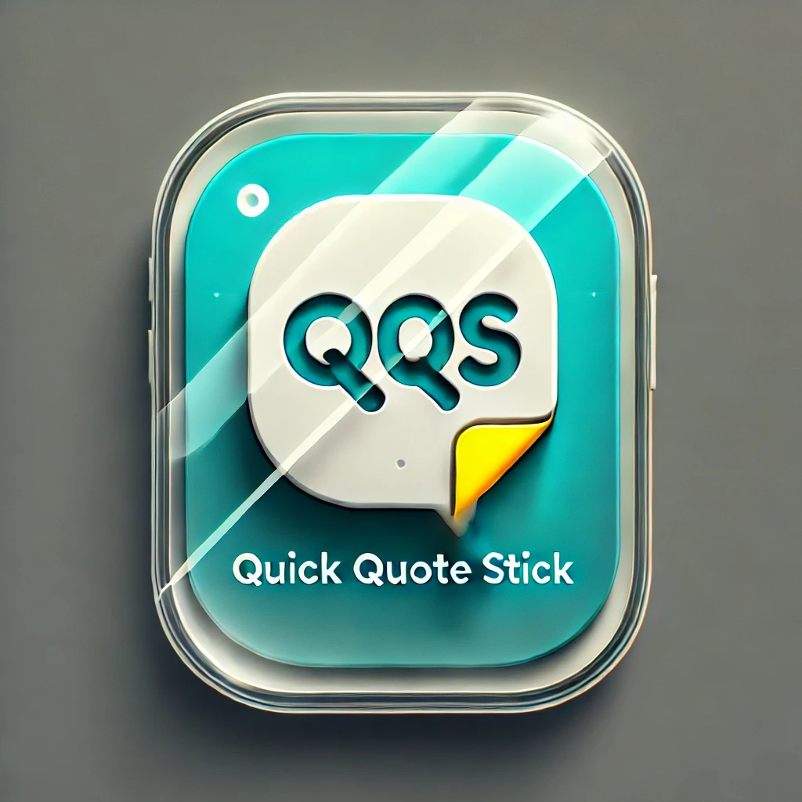

# Quick qoute stick

An application for creating stickers from quotes

## How to Use

1. Open the app and enter your text.
2. Save the text as a transparent PNG image.
3. Use the image as a sticker in Telegram.
